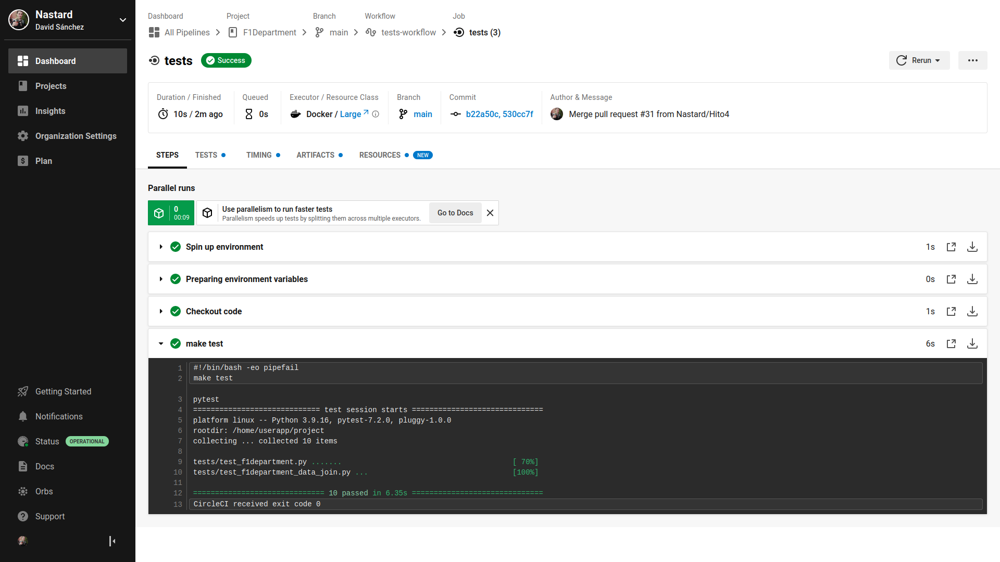

# F1Department
[](https://www.gnu.org/licenses/gpl-3.0)
[](https://app.circleci.com/pipelines/github/Nastard/F1Department?branch=main)
>Proyecto a desarrollar de la asignatura Cloud Computing del Máster en Ingeniería Informática, curso 2022-2023.

---

## Integración Continua

### Sistemas de Integración Continua
Existen diferentes sistema para Integración Continua. A continuación se muestran los sistemas más conocidos y cuáles son su
estudio:
* *Travis*: Ofrece diferentes planes de precios y permite usarlas a modo de prueba, pero para poder usarlas es necesario dar una tarjeta de crédito. A cambio, ofrece mayor características que otros sistemas. Dado que es posible que sea necesario pagar por este sistema, lo descartamos al haber otros sistemas con planes gratuitos.\
Enlace de características: https://www.travis-ci.com/pricing/

* *CircleCI*: Este sistema ofrece un plan gratuito, el cual ofrece unas características muy elevadas. Es de los sistemas más utilizados y es muy sencillo de configurar y usar y permite loguearse con GitHub. Por estas razones, se usará este sistema.\
Enlace de características: https://circleci.com/pricing/

* *GitLab*: Este sistema también es bastante conocido. Ofrece también un plan gratuito, pero no ofrece unas características muy altas. Al haber otros sistemas gratuitos y más potentes, se descarta este sistema.\
Enlace de características: https://about.gitlab.com/pricing/

* *GitHub Actions*: Aunque no sea una plataforma especialmente dedicada a la integración continua, es posible usarla como tal. Dado que hay sistemas más específicos para la integración continua, se descarta.

### Configuración del sistema elegido
Para configurar **CircleCI** se han seguidos los siguientes tutoriales oficiales:
* Para acceder al sistema: https://circleci.com/docs/first-steps/
* Ejemplos del archivo de configuración: https://circleci.com/docs/sample-config/
* Configuración del repositorio: https://circleci.com/docs/config-intro/

### Buenas prácticas
Para que se ejecute el sistema, se ha creado un archivo llamado [config.yml](../../.circleci/config.yml). De este archivo destacamos que hacemos uso del contenedor creado para la ejecución de test, **tests_f1department**, y del gestor de tareas que lanza esos tests, **Make**.

### Resultados
Una vez que el archivo **config.yml** está en el repositorio y tras hacer un **push**, podremos ver en la interfaz web de CircleCI la ejecución y resultado de los test.\


En el siguiente enlace podemos ver todos los resultados.\
https://app.circleci.com/pipelines/github/Nastard/F1Department?branch=main

---

## Creación de un contenedor para pruebas
### Imagen y tag elegida
En resumen, la imagen elegida como contenedor base ha sido **python:3.9-slim-buster** por ocupar poco espacio y por tener por defecto todo lo necesario para ejecutar los tests del proyecto.

## Archivo Dockerfile
Tras haber analizado las buenas prácticas, se ha diseñado el siguiente [Dockerfile](./Dockerfile):
Para ejecutar el archivo Dockerfile y así crear la imagen, ejecutamos en la terminal:
```
$ docker build -t testf1department .
```
Para ejecutar el contenedor, debemos ejecutar el siguiente comando:
```
$ docker run testf1department
```

## Registro de contenedores
### Docker Hub
Se ha configurado un GitHub Action para que suba automáticamente a DockerHub la imagen creada para la ejecución de tests.\
https://hub.docker.com/r/nastard/tests_f1department

### GitHub Container Registry
Ahora vamos a subir la imagen en GitHub Container Registry. Se ha configurado un GitHub Action para que también suba automática la imagen a Github Container Registry.
Podemos acceder a él a través del siguiente enlace:\
https://github.com/Nastard/F1Department/pkgs/container/f1department

---

## Ejecución de tests
### Biblioteca de aserciones
Vamos a usar Unittest porque es de las más usadas y sencillas de programar, sin necesidad de tener que instalarla. También porque se adapta bien al proyecto.

### Marco de pruebas
Vamos a usar Pytest, ya que es la más completa y sencilla y las características que ofrece son las más indicadas para este proyecto. Para usarla la instalaremos.

### Gestor de tareas
Vamos a usar Makefile, pues es el más sencillo y rápido de utilizar y es capaz de abarcar las necesidades del proyecto sin tener que realizar instalaciones adicionales o configuraciones más complejas.

---

## Concretando y planificando el proyecto
### Hitos establecidos para el proyecto
Se han establecido los siguientes Hitos para la realización de este proyecto.\
**[Hito0: Descripción del problema a resolver.](https://github.com/Nastard/F1Department/milestone/1)**\
**[Hito1: Diseño de las clases necesarias para leer y almacenar todos los datos.](https://github.com/Nastard/F1Department/milestone/2)**\
**[Hito2: Diseño de los métodos necesarios que calculará y devolverá las diferentes estadísticas relacionadas con la Formula 1.](https://github.com/Nastard/F1Department/milestone/3)**\
**[Hito3: Diseño de una API que devuelva las diferentes estadísticas.](https://github.com/Nastard/F1Department/milestone/4)**

### Historias de usuario para el proyecto
Se han establecido las siguientes historias de usuario para la realización de este proyecto.\
**[[HU1]Como administrador de la aplicación, dado que tengo disponible los datos históricos de la Formula 1, necesito unificar todos estos datos en una única estructura.](https://github.com/Nastard/F1Department/issues/4)**\
**[[HU2]Como usuario de la aplicación, quiero saber diversas estadísticas relacionadas con la Formula 1.](https://github.com/Nastard/F1Department/issues/5)**

### Descripción de las clases para el proyecto
Se han definido las siguientes clases para la realización de este proyecto.\
**[F1DepartmentDataJoin](./f1department/f1department_data_join.py)**\
**[F1Department](./f1department/f1department.py)**

---

## Descripción del Proyecto y Lógica de Negocio
### Descripción del Proyecto
Se va a desarrollar una aplicación sobre la Formula 1, competición reina del automovilismo, denominada F1Department. En resumen, esta aplicación ofrecerá multitud de estadísticas relacionadas con la Formula 1.

### Lógica de negocio
En resumen, la lógica de negocio de esta aplicación va a ser la de mostrar resultados calculados a partir de los datos disponibles. Al haber una gran cantidad de datos, se pueden generar multitud de estadísticas que nos interese analizar.

---

## Documentación del proyecto
Enlaces con la documentación del proyecto:
* [Descripción del proyecto y lógica de negocio](./docs/hito0/README.md)
* [Planificación el proyecto](./docs/hito1/README.md)
* [Test](./docs/hito2/README.md)
* [Creación de un contenedor Docker](./docs/hito3/README.md)
* [Integración continua](./docs/hito4/README.md)
