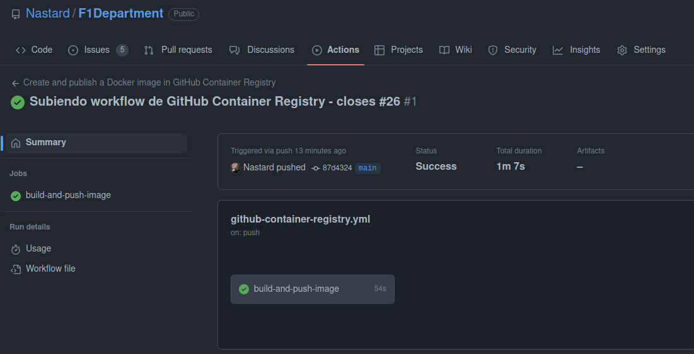
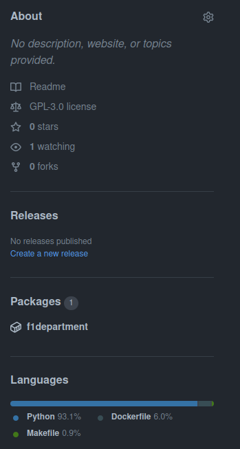
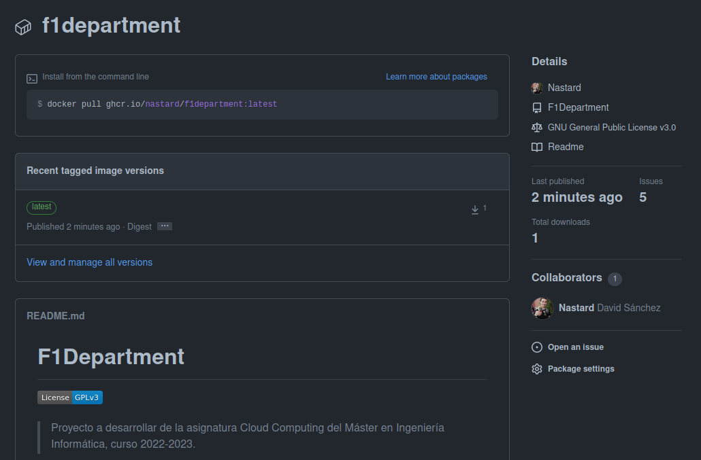

# F1Department
[](https://www.gnu.org/licenses/gpl-3.0)
>Proyecto a desarrollar de la asignatura Cloud Computing del Máster en Ingeniería Informática, curso 2022-2023.

## Creación de un contenedor para pruebas
### Elección del contenedor base
Este proyecto está realizado en Python, por lo que necesitamos una imagen de Docker que sea capaz de ejecutar los tests proyecto. Por ello se van analizar las siguientes imágenes:
* [Imagen Oficial de Ubuntu](https://hub.docker.com/_/ubuntu)
* [Imagen Oficial de Python](https://hub.docker.com/_/python)
* [Imagen Oficial de Alpine](https://hub.docker.com/_/alpine)

A modo resumen, mostramos las imágenes probadas, donde podemos ver el tamaño en disco de cada una.


#### Imagen Oficial de Ubuntu
Dado que el proyecto se está desarrollando en Ubuntu, se ha probado las imágenes oficiales de Ubuntu, concretamente las versiones *20.04* y *22.04(latest)*. Como podemos ver, ambas versiones ocupan poco espacio, pero el problema de usar estas imágenes es que no disponen de Python instalado por defecto, por lo que tendríamos que instalarlo.


Dado que Python tiene una imagen oficial, nos podemos ahorrar su instalación si usamos alguna imagen de Python, sin que el tamaño usado no se vea afectado enormemente.

#### Imagen Oficial de Python
Python ofrece diferentes tags de su imagen. Estas tags depende de la versión de Python y de otras características. Al ser imágenes de Python, tienen lo necesario para poder ejecutar los tests del proyecto, a excepción del gestor de tareas *Make* que hemos elegido. Como vemos en la primera imagen, usando la tag *latest* de Python es la que más pesa comparado con las otras, por la que la descartamos. Las tags de *alpine* están muy limitadas en cuanto a los comandos que dispone, por lo que no nos viene bien en este proyecto, aunque su espacio sea muy pequeño. Las tags *slim* ofrecen todo lo necesario para poder ejecutar los tests del proyecto y con un tamaño muy competente. Como vemos ofrece diferentes tags, por lo que usaremos la tag *3.9-slim-buster*, pues es la que menos ocupa, ofreciendo lo mismo que las demás. Dado que Python tiene muchas versiones, nos hemos inclinado por la versión *3.9*, pues es compatible con las librerías necesarias del proyecto, definidas en el archivo *requirements.txt*.

#### Imagen Oficial de Alpine
Las imágenes de Alpine son las que menos espacio ocupan, pero al igual que las de Ubuntu, habría que instalar Python, por lo que la descartamos también.

#### Imagen y tag elegida
En resumen, la imagen elegida como contenedor base ha sido **python:3.9-slim-buster** por ocupar poco espacio y por tener por defecto todo lo necesario para ejecutar los tests del proyecto.

## Archivo Dockerfile

### Buenas prácticas en archivos Dockerfiles
Existe una serie de buenas prácticas a la hora de crear un Dockerfile. Estas prácticas sirven para mejorar la seguridad del contenedor o incluso conseguir que los contenedores ocupen menos espacio en disco. El siguiente enlace detalla muy bien estas prácticas.

[Docker best practices, testdriven.io](https://testdriven.io/blog/docker-best-practices/)

Para este proyecto, se ha usado las siguientes buenas prácticas:
* Los comandos usados en el archivo Dockerfile siguen un orden para construir el contenedor.
* Se ha usado una imagen con poco tamaño, pero ofreciendo todo lo que necesitamos, en concreto la imagen **python:3.9-slim-buster** que ocupa 117MB.
* Se ha minimizado el número de capas, combinando cuando ha sido posible los comandos *RUN* y *COPY*.
* Se ha creado un usuario para que el contenedor no sea usado como *root*.
* El contenedor solo hace un proceso, que es el de ejecutar los test del proyecto.
* Se usa el comando *ENTRYPOINT* en vez de *CMD*, el cual previene que el comando ejecutado sea modificado.

### Archivo Dockerfile diseñado
Tras haber analizado las buenas prácticas descritas anteriormente, se ha diseñado el siguiente Dockerfile:
```
FROM python:3.9-slim-buster

WORKDIR /usr/app

COPY requirements.txt .

RUN apt-get update \
	&& apt-get upgrade -y \
	&& apt-get install make \
	&& pip3 install -r requirements.txt

COPY . .

RUN addgroup --system userapp \
	&& adduser --system userapp \
	&& adduser userapp userapp \
	&& chown -R userapp:userapp .

USER userapp

ENTRYPOINT ["make", "test"]
```
Para ejecutar el archivo Dockerfile y así crear la imagen, ejecutamos en la terminal:
```
$ docker build -t testf1department .
```
Y una vez finalice podemos ver el tamaño que ocupa la imagen:

Para ejecutar el contenedor, debemos ejecutar el siguiente comando:
```
$ docker run testf1department
```
Y como vemos, los test se ejecutan correctamente:


## Registro de contenedores
Se ha subido el contenedor creado para los tests en DockerHub y en el registro público de contenedores de GitHub, GitHub Container Registry. Para realizar esta parte se ha seguido la siguiente guía:

[Publishing Docker images](https://docs.github.com/en/actions/publishing-packages/publishing-docker-images)

### Docker Hub
Se ha configurado un GitHub Action para que suba automáticamente a DockerHub la imagen creada para la ejecución de tests. Se definen dos *SECRETS* en el repositorio para la autenticación de Docker Hub. Ahora se define el archivo *yml* para el flujo, y como vemos a continuación, el flujo se ejecuta correctamente y crea la imagen en nuestro repositorio de DockerHub:


### GitHub Container Registry
Ahora vamos a subir la imagen en GitHub Container Registry. Se ha configurado un GitHub Action para que también suba automática la imagen a Github Container Registry. A continuación se muestra que el flujo se ejecuta correctamente:



Podemos ver que en el repositorio de GitHub aparece nuestro nuevo paquete:



Podemos acceder a él a través del siguiente enlace:

https://github.com/Nastard/F1Department/pkgs/container/f1department



## Ejecución de tests
### Biblioteca de aserciones
Vamos a usar Unittest porque es de las más usadas y sencillas de programar, sin necesidad de tener que instalarla. También porque se adapta bien al proyecto.

### Marco de pruebas
Vamos a usar Pytest, ya que es la más completa y sencilla y las características que ofrece son las más indicadas para este proyecto. Para usarla la instalaremos.

### Gestor de tareas
Vamos a usar Makefile, pues es el más sencillo y rápido de utilizar y es capaz de abarcar las necesidades del proyecto sin tener que realizar instalaciones adicionales o configuraciones más complejas.

## Concretando y planificando el proyecto
### Hitos establecidos para el proyecto
Se han establecido los siguientes Hitos para la realización de este proyecto.\
**[Hito0: Descripción del problema a resolver.](https://github.com/Nastard/F1Department/milestone/1)**\
**[Hito1: Diseño de las clases necesarias para leer y almacenar todos los datos.](https://github.com/Nastard/F1Department/milestone/2)**\
**[Hito2: Diseño de los métodos necesarios que calculará y devolverá las diferentes estadísticas relacionadas con la Formula 1.](https://github.com/Nastard/F1Department/milestone/3)**\
**[Hito3: Diseño de una API que devuelva las diferentes estadísticas.](https://github.com/Nastard/F1Department/milestone/4)**

### Historias de usuario para el proyecto
Se han establecido las siguientes historias de usuario para la realización de este proyecto.\
**[[HU1]Como administrador de la aplicación, dado que tengo disponible los datos históricos de la Formula 1, necesito unificar todos estos datos en una única estructura.](https://github.com/Nastard/F1Department/issues/4)**\
**[[HU2]Como usuario de la aplicación, quiero saber diversas estadísticas relacionadas con la Formula 1.](https://github.com/Nastard/F1Department/issues/5)**

### Descripción de las clases para el proyecto
Se han definido las siguientes clases para la realización de este proyecto.\
**[F1DepartmentDataJoin](./f1department/f1department_data_join.py)**\
**[F1Department](./f1department/f1department.py)**

## Descripción del Proyecto y Lógica de Negocio
### Descripción del Proyecto
Se va a desarrollar una aplicación sobre la Formula 1, competición reina del automovilismo, denominada F1Department. En resumen, esta aplicación ofrecerá multitud de estadísticas relacionadas con la Formula 1.

### Lógica de negocio
En resumen, la lógica de negocio de esta aplicación va a ser la de mostrar resultados calculados a partir de los datos disponibles. Al haber una gran cantidad de datos, se pueden generar multitud de estadísticas que nos interese analizar.

## Documentación del proyecto
Enlaces con la documentación del proyecto:
* [Documentación del Hito 0 de la asignatur, Descripción y lógica](./docs/hito0/README.md)
* [Documentación del Hito 1 de la asignatura, Planificación](./docs/hito1/README.md)
* [Documentación del Hito 2 de la asignatura, Test](./docs/hito2/README.md)
* [Documentación del Hito 3 de la asignatura, Creación de un contenedor](./docs/hito3/README.md)
