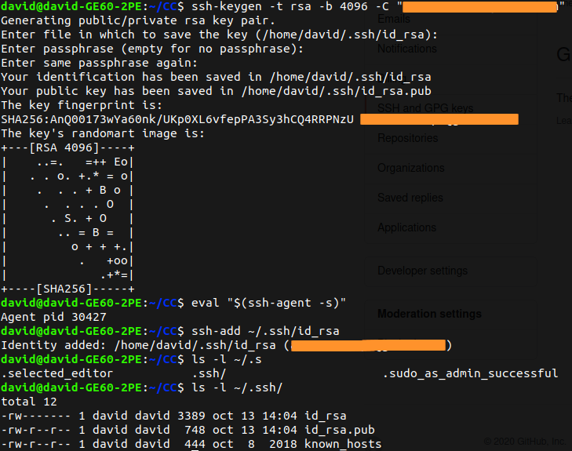
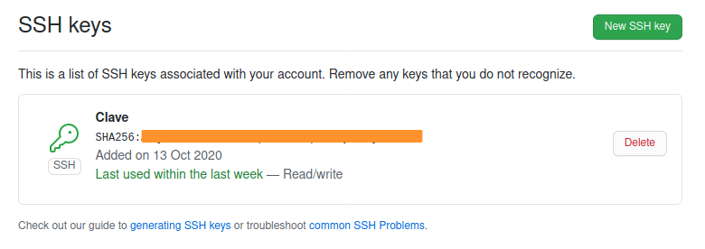
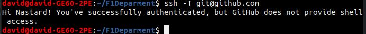
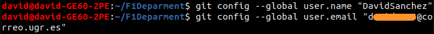
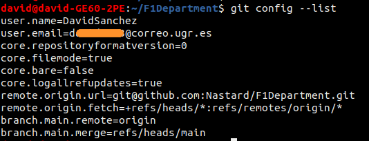
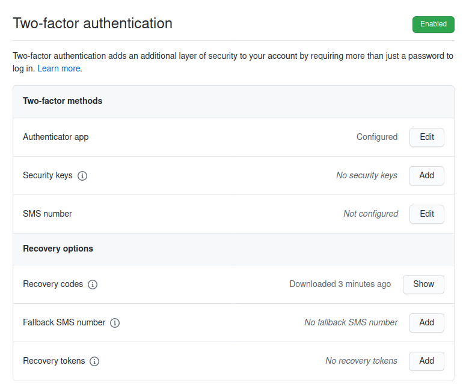

# Configuración inicial de GIT
A continuación se muestran los pasos hechos para la creación y configuración del repositorio.

## Creación de par de claves y subida de clave pública a GitHub.
Se ha usado el siguiente [tutorial](https://docs.github.com/es/free-pro-team@latest/github/authenticating-to-github/generating-a-new-ssh-key-and-adding-it-to-the-ssh-agent) para realizar esta parte.
La siguiente imagen muestra la creación de las claves, con los comandos indicados en el [tutorial](https://docs.github.com/es/free-pro-team@latest/github/authenticating-to-github/generating-a-new-ssh-key-and-adding-it-to-the-ssh-agent).\

A continuación se muestra la clave pública subida en GitHub.\

Y cómo funciona correctamente el protocolo SSH en el ordenador.\

## Configuración correcta del nombre y correo electrónico para que aparezca en los commits.
Los comandos de la siguiente imagen muestran cómo se ha configurado el nombre y correo electrónico.\

A continuación mostramos que la configuración se ha guardado correctamente.\

## Edición del perfil de GitHub para que aparezca una imagen en vez del avatar por omisión, nombre completo y ciudad, así como universidad.
En la siguiente imagen se muestra los requisitos que nos pide este apartado.\

## Incrementar la seguridad de nuestra cuenta en GitHub activando el segundo factor de autenticación.
Se ha configurado la opción de doble factor de autenticación con la aplicación de móvil Authy.\

