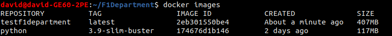

# Archivo Dockerfile

## Buenas prácticas en archivos Dockerfiles
Existe una serie de buenas prácticas a la hora de crear un Dockerfile. Estas prácticas sirven para mejorar la seguridad del contenedor o incluso conseguir que los contenedores ocupen menos espacio en disco. El siguiente enlace detalla muy bien estas prácticas.

[Docker best practices, testdriven.io](https://testdriven.io/blog/docker-best-practices/)

Para este proyecto, se ha usado las siguientes buenas prácticas:
* Los comandos usados en el archivo Dockerfile siguen un orden para construir el contenedor.
* Se ha usado una imagen con poco tamaño, pero ofreciendo todo lo que necesitamos, en concreto la imagen **python:3.9-slim-buster** que ocupa 117MB.
* Se ha minimizado el número de capas, combinando cuando ha sido posible los comandos *RUN* y *COPY*.
* Se ha creado un usuario para que el contenedor no sea usado como *root*.
* El contenedor solo hace un proceso, que es el de ejecutar los test del proyecto.
* Se usa el comando *ENTRYPOINT* en vez de *CMD*, el cual previene que el comando ejecutado sea modificado.

## Archivo Dockerfile diseñado
Tras haber analizado las buenas prácticas descritas anteriormente, se ha diseñado el siguiente Dockerfile:
```
FROM python:3.9-slim-buster

WORKDIR /usr/app

COPY requirements.txt .

RUN apt-get update \
	&& apt-get upgrade -y \
	&& apt-get install make \
	&& pip3 install -r requirements.txt

COPY . .

RUN addgroup --system userapp \
	&& adduser --system userapp \
	&& adduser userapp userapp \
	&& chown -R userapp:userapp .

USER userapp

ENTRYPOINT ["make", "test"]
```
Para ejecutar el archivo Dockerfile y así crear la imagen, ejecutamos en la terminal:
```
$ docker build -t testf1department .
```
Y una vez finalice podemos ver el tamaño que ocupa la imagen:

Para ejecutar el contenedor, debemos ejecutar el siguiente comando:
```
$ docker run testf1department
```
Y como vemos, los test se ejecutan correctamente:

