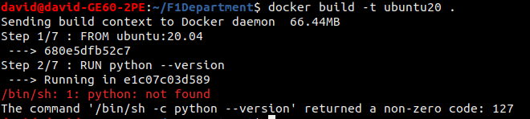

# Contenedor Docker

## Elección del contenedor base
Este proyecto está realizado en Python, por lo que necesitamos una imagen de Docker que sea capaz de ejecutar los tests proyecto. Por ello se van analizar las siguientes imágenes:
* [Imagen Oficial de Ubuntu](https://hub.docker.com/_/ubuntu)
* [Imagen Oficial de Python](https://hub.docker.com/_/python)
* [Imagen Oficial de Alpine](https://hub.docker.com/_/alpine)

A modo resumen, mostramos las imágenes probadas, donde podemos ver el tamaño en disco de cada una.

### Imagen Oficial de Ubuntu
Dado que el proyecto se está desarrollando en Ubuntu, se ha probado las imágenes oficiales de Ubuntu, concretamente las versiones *20.04* y *22.04(latest)*. Como podemos ver, ambas versiones ocupan poco espacio, pero el problema de usar estas imágenes es que no disponen de Python instalado por defecto, por lo que tendríamos que instalarlo.

Dado que Python tiene una imagen oficial, nos podemos ahorrar su instalación si usamos alguna imagen de Python, sin que el tamaño usado no se vea afectado enormemente.

### Imagen Oficial de Python
Python ofrece diferentes tags de su imagen. Estas tags depende de la versión de Python y de otras características. Al ser imágenes de Python, tienen lo necesario para poder ejecutar los tests del proyecto, a excepción del gestor de tareas *Make* que hemos elegido. Como vemos en la primera imagen, usando la tag *latest* de Python es la que más pesa comparado con las otras, por la que la descartamos. Las tags de *alpine* están muy limitadas en cuanto a los comandos que dispone, por lo que no nos viene bien en este proyecto, aunque su espacio sea muy pequeño. Las tags *slim* ofrecen todo lo necesario para poder ejecutar los tests del proyecto y con un tamaño muy competente. Como vemos ofrece diferentes tags, por lo que usaremos la tag *3.9-slim-buster*, pues es la que menos ocupa, ofreciendo lo mismo que las demás. Dado que Python tiene muchas versiones, nos hemos inclinado por la versión *3.9*, pues es compatible con las librerías necesarias del proyecto, definidas en el archivo *requirements.txt*.

### Imagen Oficial de Alpine
Las imágenes de Alpine son las que menos espacio ocupan, pero al igual que las de Ubuntu, habría que instalar Python, por lo que la descartamos también.

### Imagen y tag elegida
En resumen, la imagen elegida como contenedor base ha sido **python:3.9-slim-buster** por ocupar poco espacio y por tener por defecto todo lo necesario para ejecutar los tests del proyecto.
