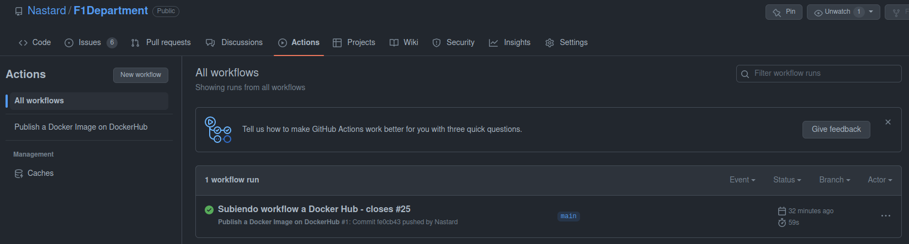
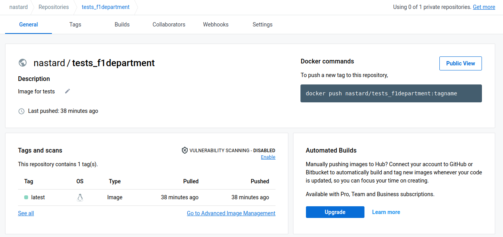
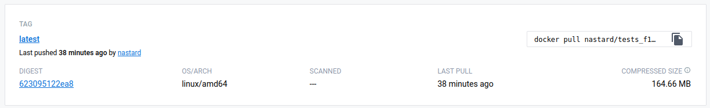
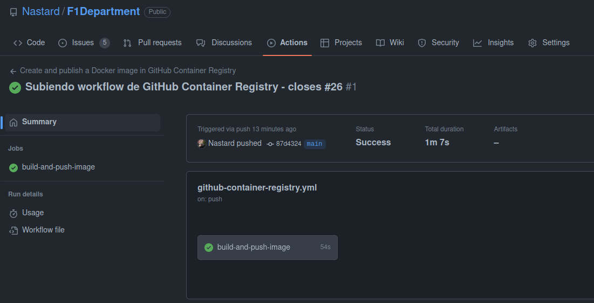
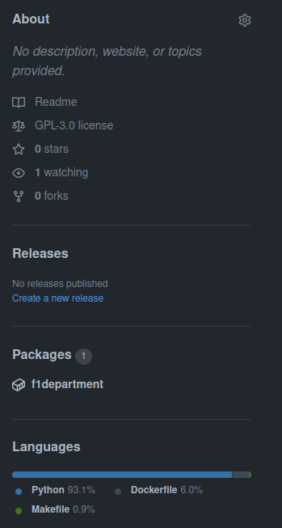
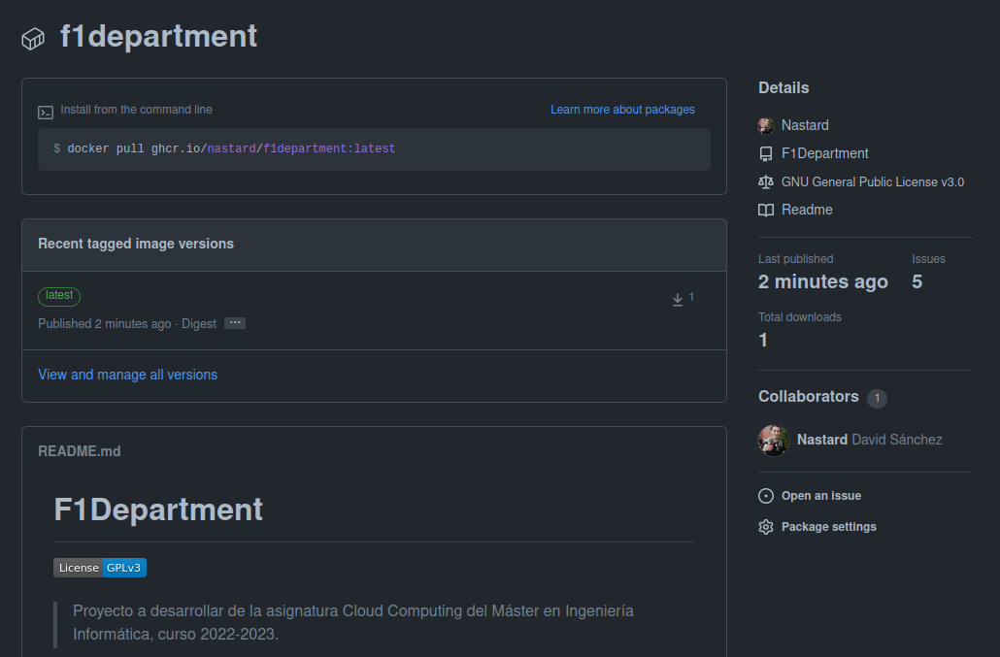

# Registro de contenedores
Se ha subido el contenedor creado para los tests en DockerHub y en el registro público de contenedores de GitHub, GitHub Container Registry. Para realizar esta parte se ha seguido la siguiente guía:

[Publishing Docker images](https://docs.github.com/en/actions/publishing-packages/publishing-docker-images)

## Docker Hub
Se ha configurado un GitHub Action para que suba automáticamente a DockerHub la imagen creada para la ejecución de tests. Se definen dos *SECRETS* en el repositorio para la autenticación de Docker Hub. Ahora se define el archivo *yml* para el flujo, y como vemos a continuación, el flujo se ejecuta correctamente y crea la imagen en nuestro repositorio de DockerHub:

## GitHub Container Registry
Ahora vamos a subir la imagen en GitHub Container Registry. Se ha configurado un GitHub Action para que también suba automática la imagen a Github Container Registry. A continuación se muestra que el flujo se ejecuta correctamente:

Podemos ver que en el repositorio de GitHub aparece nuestro nuevo paquete:

Podemos acceder a él a través del siguiente enlace:

https://github.com/Nastard/F1Department/pkgs/container/f1department

